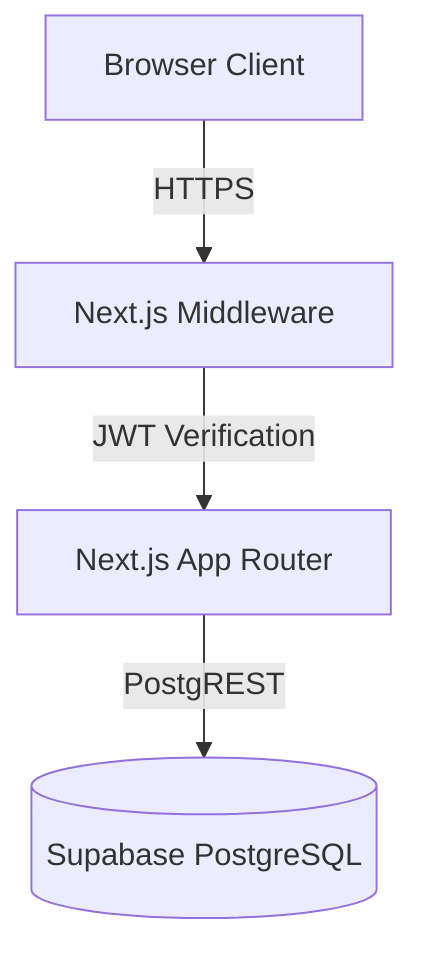
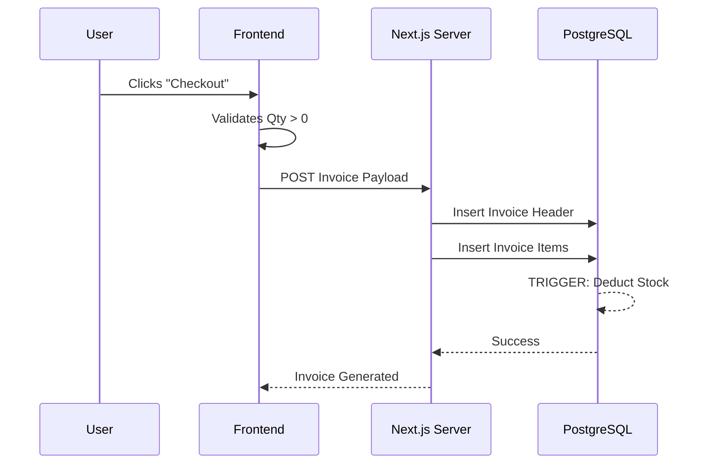

# System Architecture

The **TyreRetail Pro ERP** is engineered as a modern, full-stack application leveraging serverless paradigms and the Next.js App Router.

## High-Level Diagram

## Core Components

1. **Next.js App Router**: Handles React Server Components (RSC) to reduce client-side Javascript payload. Layouts fetch base data (like user permissions) server-side, passing only interactive HTML to the browser.
2. **Edge Middleware (`src/proxy.ts`)**: Serves as the immediate security gateway. It intercepts every request at the Edge, verifies the Supabase session JWT, and routes `owner` and `accountant` roles to their respective dashboards.
3. **Supabase Backend**:
   - **Authentication**: JWT-based stateless auth.
   - **PostgreSQL Database**: Relational tables with strict Check Constraints and Unique Keys.
   - **Database Triggers**: Atomic inventory calculations are handled directly on the database via triggers on the `invoice_items` and `purchase_items` tables, eliminating race conditions.

## Authentication Flow
1. User submits credentials on `/login`.
2. Supabase Auth returns a JWT and sets a secure HTTP-only cookie.
3. Next.js Middleware reads the cookie on subsequent navigation, validating the session and Role-Based Access Control (RBAC).

## Inventory Data Flow

